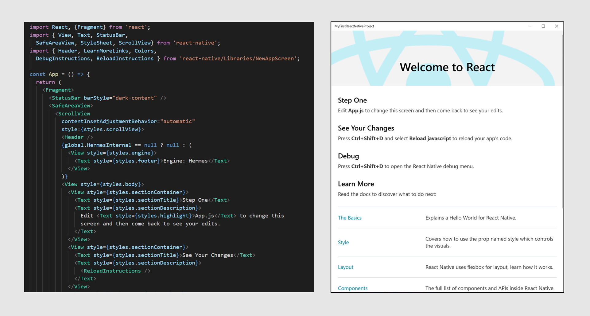

<h2>Bringing React Native to Windows devices</h2>
        
            

<a href="https://github.com/microsoft/react-native-windows/blob/master/vnext/docs/GettingStarted.md" class="btn">Get Started </a>

[React Native](http://facebook.github.io/react-native) enables you to build world-class native application experiences on multiple platforms using a consistent developer experience based on JavaScript and [React](https://reactjs.org/). 

**React Native for Windows brings React Native support for the [Windows 10 SDK](https://developer.microsoft.com/en-us/windows/downloads)**. With this, you can use Javascript to build native Windows apps for [all devices supported by Windows 10](https://developer.microsoft.com/en-us/windows/get-started-windows-10) including PCs, tablets, 2-in-1s, Xbox, Mixed reality devices etc. 

You can use React Native for Windows in any way you like:
- Add Windows support to your existing React Native projects for iOS and/or Android 
- Create full Windows 10 apps using React Native for Windows from scratch 
- Add React Native for Windows components to your existing native Windows 10 projects 
- Add React Native for Windows components to your existing Win32 projects using XamlIslands

## Status and Roadmap

We are in the process of re-implementing React Native for Windows in C++, for better performance, and to better align with the shared C++ react-native core as it evolves as part of the `vnext` effort. Please see the  [Roadmap 2019](blog/Roadmap2019) blog for details on this effort and investment roadmap for the upcoming months. 

**React Native for Windows vnext now supports React Native version 0.60.** Download the latest [npm package](https://www.npmjs.com/package/react-native-windows) to get the updates. 

## Resources

Develop a React Native for Windows app - [Getting Started](https://github.com/microsoft/react-native-windows/blob/master/vnext/docs/GettingStarted.md). Learn the **basics of React Native** using the [React Native Tutorial](https://facebook.github.io/react-native/docs/tutorial.html).

Learn about the core [React Native Components and APIs](https://facebook.github.io/react-native/docs/activityindicator). Almost all of these are supported by React Native for Windows and we continue to add more support. Take a look at the [API Parity status](https://github.com/microsoft/react-native-windows/blob/master/vnext/docs/ParityStatus.md) for a live glimpse of any missing or partially implemented React Native APIs on Windows. 

In addition to the core, we have added a few **extra APIs and features on Windows**. 
   - Learn how to access signature Windows themes and Fluent Design visuals like Acrylic and Reveal from React Native for Windows - [Windows Brushes and Themes](https://github.com/microsoft/react-native-windows/blob/master/vnext/docs/windowsbrushandtheme.md).
   - You can begin taking a look [here](https://github.com/microsoft/react-native-windows/tree/master/vnext/docs/api) for new Windows specific APIs.  

Learn how to **extend React Native for Windows** through [Native modules](https://github.com/microsoft/react-native-windows/blob/master/vnext/docs/NativeModules.md) and [Native UI components](https://github.com/microsoft/react-native-windows/blob/master/vnext/docs/ViewManagers.md).

Take a look at some of the **sample apps** we have published for inspiration:
   - [Calculator app](https://github.com/microsoft/react-native-windows-samples/tree/master/samples/Calculator) shows an example of a full cross-platform React Native app for iOS, Android and Windows. 
   - [ToDos Feed app](https://github.com/microsoft/react-native-windows-samples/tree/master/samples/TodosFeed) illustrates the usage of React Native for Windows in 3 different contexts: as a full Windows 10 app, as a component in a native Windows 10 app and as a component in a Win32 app. This sample is a companion for a blog post about React Native for Windows, which is available on the [Windows AppConsult blog](https://techcommunity.microsoft.com/t5/Windows-Dev-AppConsult/Getting-started-with-React-Native-for-Windows/ba-p/912093).

Lastly, we are fully **open source**. Head over to React Native for Windows [GitHub](https://github.com/microsoft/react-native-windows) to learn more, file issues and begin contributing. 

You can follow us on Twitter [@ReactWindows](https://twitter.com/ReactWindows) for latest news and updates. 

