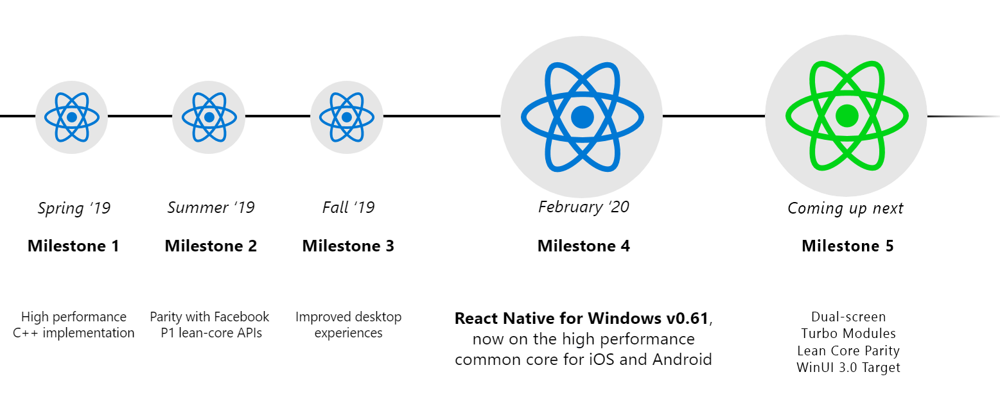

Announcing React Native for Windows v0.61, now on the high performance common core across iOS and Android!

<!--truncate-->

This milestone is a huge one for us on the React Native for Windows team and we're super excited to officially announce that the work we have been doing in our C++ overhaul (formerly dubbed vnext) is now the new default framework installed when you integrate Windows into your React Native project.

The work in this latest release doesn't stop there though, check out all the other cool stuff we've released below!

## We're on version 0.61

That's right! React Native for Windows is now fully up-to-date with React Native core's latest version - and we're planning to keep updated with their latest version with as little latency as possible.

We've updated the [Getting Started Guide](https://microsoft.github.io/react-native-windows/docs/getting-started) to reflect these changes and when you install the [ReactNative for Windows npmjs package](https://www.npmjs.com/package/react-native-windows) you will get these updates in that package.

## Fewer steps to get started

With the convergence of vnext into our default React Native for Windows framework, you no longer need to specify a vnext template in the setup CLI steps.

This means after you [setup your React Native project](https://microsoft.github.io/react-native-windows/docs/getting-started), all you have to do is add our plugin:

```
yarn add rnpm-plugin-windows
```

And install the Windows extension:

```
react-native windows
```

Now you're ready to start developing for Windows!

## Our documentation is expanding

In addition to reducing the steps needed to get started **developing** in React Native for Windows - we're also expanding the docs to make it easier to access relevant information around **how to develop** for Windows using React Native.

One really big way we know we can help accelerate developers is through thorough and related documentation. That's why we've added two whole new sections this site:

- [Versions](https://microsoft.github.io/react-native-windows/versions)
  With versions we will now be tracking our release changelogs, older documentation so changes to certain APIs or components can be tracked, and stable versus latest releases so as a developer you can know exactly when to upgrade to ensure your app's performance and features are safe.
- [APIs](https://microsoft.github.io/react-native-windows/docs/flyout-component)
  The APIs section is now available to reference! All Windows and Mac API and Components will be listed there with a familiar layout to help you know which properties do what you need and what's available to you on the Windows and Mac components.

**But wait, did you say Mac?**

That wasn't a typo!

We've actually begun investing in [React Native for Mac](https://www.aka.ms/react-native-mac). Although this progress is still in its early stages, a lot of the functionality and features we implemented for Windows are also shared on the Mac, so this gives us a nice head start here and is one of the many reasons we decided to undertake this effort.

You may also notice that we've added Mac to the this site and as we expand in the React Native for Mac area, we will continue to add documentation and support for developers right here.

## Improved performance

A large improvement to performance happened in this last release that had to due with our threading model. You might have also heard us calling this the "confident instancing programming model".

What we did was update the host and instance infrastructure in React Native for Windows to have a more robust and consistent threading model. While this change helps increase thread stability today, it will also enable us to support more complex scenarios like hosting multiple RN instances within the same app in the future.

## SVG Image support

As of this latest release we now natively support svg files. No separate component or module is needed - just simply use the Image component in your React Native app and when you target Windows your svg files will be loaded and used just as they should.

## Coming up next



If you're curious about our immediate and future plans, feel free to check out our [milestone progress on our repo](https://github.com/microsoft/react-native-windows/milestones), but there are also some other cool things to get excited about that we'll be focusing on between now and April 2020. Check them out below!

### February

- **Dual-screen support**

  We're bringing [TwoPaneView](https://docs.microsoft.com/en-us/uwp/api/microsoft.ui.xaml.controls.twopaneview?view=winui-2.2) to React Native for Windows as a component! This means React Native developers will have the ability to be easily conscious of when their app is displaying on one of the screens or expanding across both - with the API automatically adjusting for the hinge seam allowance in the center - so no app information is lost.

  You can participate in the conversation on these modules here: [TwoPaneView](https://github.com/react-native-community/discussions-and-proposals/issues/197) and [ExtendedDeviceInfo](https://github.com/react-native-community/discussions-and-proposals/issues/189)

- **API parity**
  We are investing in tooling to comprehensively measure API parity of react-native-windows with all react-native APIs. This will help set us up for complete API parity in March and April milestones to follow.

- **Community modules updates to support Windows**

  We know that community modules and extensions are an important part of building a great React Native app. We’re currently working on adding support to **react-native-video** and will be starting work on migrating **Picker** and **WebView** modules to the corresponding community repos in February.

  A lot more are planned for future months, you can find the native modules on our radar on this [project board](https://github.com/microsoft/react-native-windows/projects/23).

  Feel free to file issues if there are more you would like to see Windows add support for.
  For getting starting building native modules, [the guide can be found here](https://microsoft.github.io/react-native-windows/docs/native-modules).

- **Upgrade helper**
- **Alleviate disk space issues with CI**

### March

- [Turbo Modules](https://github.com/react-native-community/discussions-and-proposals/blob/master/proposals/0002-Turbo-Modules.md )
- Lottie
- Upgrade to 0.62
- API completion (Accessibility, View Style)
- Integration with react-native init
- Integration with Facebook documentation
- Turbo Modules investigation
- Transition keyboard changes into RN core

### April

- AsyncStorage/FS modules
- Helix for downlevel testing
- API completion (TouchableWithoutFeedback, AppState, LayoutAnimatoin, ScrollView)
- Keyboarding improvements (autofocus, focus lost, tabbing, etc.)
- Community module directory
- VSCode integration, TypeScript, direct debugging, Windows config
- Targetting WinUI 3.0
